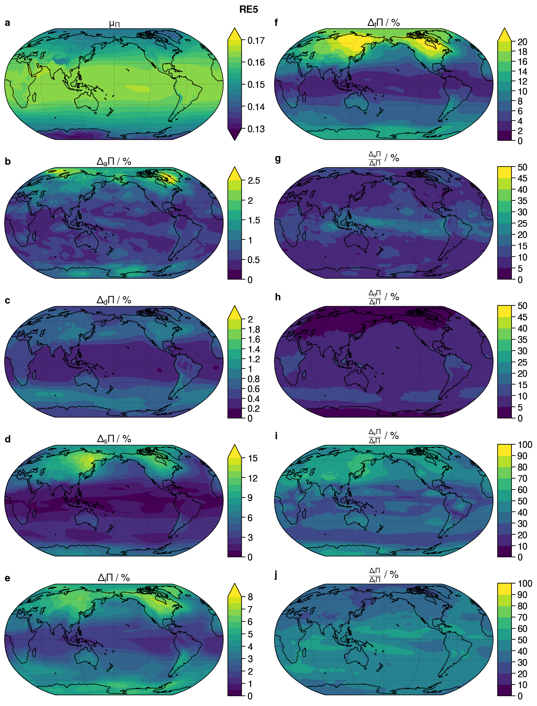

# **<div align="center">PiPWV</div>**

This repository contains the basic setup for the **PiPWV** project, written in Julia.  We aim to:
   (1) compare different values of Π calculated from different types of datsets
   (2) create an automated creation of dataset Π based on ERA5 reanalysis data using Julia and `CDSAPI.jl`

**Created/Mantained By:** Nathanael Wong (nathanaelwong@fas.harvard.edu)\
**Other Contributors:** Lujia Feng (lfeng@ntu.edu.sg)

> Introductory Text Here.

## Progress

* [x] Data Downloads
   * [x] Downloaded ERA5 Raw Data
   * [x] Downloaded ERA-Interim Raw Data

* [x] Calculation of Tm and `Π`
   * [x] **RE5:** Reanalysis - ERA5 - Vertical
   * [x] **REI:** Reanalysis - ERA-Interim - Vertical
   * [x] **REP:** Reanalysis - ERA5 - Pressure
   * [x] **RGA:** Reanalysis - GGOS Atmosphere [Bohm et al., 2013] (calculated from ERA-Interim)
   * [x] **EBB:** Empirical - Bevis et al. [1992] approximation - Bevis et al. [1992] Coefficients
   * [x] **EBM:** Empirical - Bevis et al. [1992] approximation - Manandhar et al. [2017] Coefficients
   * [x] **EMN:** Empirical - Manandhar et al. [2017]
   * [x] **EG2:** Empirical - GPT2w Model [Bohm et al., 2015] derived from GGOS Atmosphere

* [x] Analysis/Comparison between Datasets
   * [x] Analysis of diurnal and seasonal variability for **RE5**
   * [x] Comparison of **RE5** to **REI** and see if **RE5** is vastly different from **REI** and how
   * [x] Comparison to **RE5** to **REP** and see if **REP** is close to **RE5** so that in the future can use **REP** and save computational power and data downloading time
   * [x] Comparison of **REI** to **RGA** (since RGA is taken from ERA-Interim, so comparing a direct ERA-Interim calculation makes more sense)
   * [x] Compare **RE5** to **EBB** and **EBM** to see if Bevis et al. [1992] methodology is a globally valid approximation
   * [x] See if empirical models **EG2** and **EMN** are close approximations or if it would be better to just use a single gridded `Π` dataset

* [ ] Π Dataset creation
   * [ ] Write functions (modify from `ClimateERA`) to download daily meteorological data
   * [ ] Calculate Π daily and append to relevant NetCDF file using `NCDatasets`

## 0. Motivation

The conversion between GPS/GNSS Zenith Wet Delay (ZWD) to Precipitable Water has always been a source of study, specifically due to the approximations made to calculate the mean water-vapour weighted column temperature (Tm), which in turn affect the variable Π for which the relationship between ZWD and Precipitable Water depends.  The full accepted equation is given by:


This formula however, has several drawbacks.  It requires temperature and humidity profiles over the entire vertical column, which are best measured using radiosonde profiles.  However, (1) radiosondes are expensive and typically profiles are not as widely available, (2) radiosonde measurements are typically made once- or twice-daily even when available, and (3) radiosonde profiles are mostly conducted over land.  This can be compensated for using reanalysis, and calculations of Π made from reanalysis have been shown to be close to those derived from radiosonde profiles.

Therefore, we aim to explore several different approximations to Π using reanalysis data, and calculate a global-gridded dataset for both Tm and Π that is automatically updated every few days.

## 1. Different approximations for Π

In this project, we studied and compared the following methods for calculating and/or approximating Π

1) ERA5 reanalysis, using the initial vertical coordinates
2) ERA5 reanalysis with the equation for Tm transformed into pressure coordinates
3) ERA-Interim reanalysis, using initial vertical coordinates
4) GGOS Atmospheres dataset, which is a Tm dataset for ERA-Interim
5) Bevis et al. (1992) empirical method, surface temperature (Ts) from ERA5 reanalysis, and
   a) Coefficients `a` and `b` as in Bevis et al. (1992)
   b) Coefficients `a` and `b` as in Manandhar et al. [2017]
6) Manandhar et al. [2017] empirical formula that directly calculates Π
7) GPT2w Model [Bohm et al., 2015], which is an empirical model derived from the GGOS Atmospheres dataset

All analysis was performed at 1.0º spatial resolution.

*(Note: We are considering doing a similar analysis for the CFSRv2 and MERRA2 reanalysis datasets, though the eta for this analysis is yet unconfirmed.)*

### A. Conversion from vertical to pressure coordinates

Reanalysis data is generally given in pressure coordinates, not pure vertical coordinates.  As a result, we attempt to see if we can convert the initial Tm equation from vertical coordinates *z* to pressure coordinates *p*.  We see that this conversion helps to reduce the number of variables we need to download, saving the time required for the calculation of Tm and Π in our final product.


We see that in vertical coordinates, we would need the specific humidity (q), temperature (T), vertical height (z) of each pressure level, and orographic height (zs), which requires 3 3D (lon,lat,pressre) datasets and 1 2D (lon,lat) dataset.  However, for the pressure coordinates, we would need only specific humidity (q), temperature (T), and surface pressure (ps), which is 2 3D datasets and 1 2D dataset.  This saves not only downloading time, but also memory space when performing the calculations.

### B. GGOS Atmosphere Dataset

The GGOS Atmosphere dataset provides 6-hourly Tm data at the 2.5º lon x 2.0º lat spatial resolution.  We treat this dataset as a reference, while also noting discrepancies between our results and that from the GGOS Atmosphere dataset that could be due to interpolation of the dataset to the 1.0º resolution.

### C. Bevis et al. (1992)

Bevis et al. (1992) approximated Tm as a linear function of the surface temperature Ts using the equation:


It has been noted in several different studies that the coefficients `a` and `b` are not constant over the globe, but instead vary in space, most especially by latitude.  Therefore, we test the approximation not only using the coefficients given by the original Bevis et al. (1992) paper (*a* = , *b* = ), which were found in the United States, but also with the coefficients from Manandhar et al. [2017], who found values of `a` and `b` for a different set of latitudes.

### D. Manandhar et al. (2017)

Manandhar et al. (2017) directly calculates Π from latitude, day-of-year and orographic height using the following equation:


### E. GPT2w Model

The GPT2w model is an empirical model derived from monthly-averaged GGOS Atmosphere and ERA-Interim datasets.  This dataset is meant to be invariant over different years.

## 2. ERA5 Tm and Π climatology



## Installation

To (locally) reproduce this project, do the following:

0. Download this code base. Notice that raw data are typically not included in the
   git-history and may need to be downloaded independently.
1. Open a Julia console and do:
   ```
   julia> ] activate .
    Activating environment at `~/Projects/PiPWV/Project.toml`

   (PiPWV) pkg> instantiate
   ```

This will install all necessary packages for you to be able to run the scripts and
everything should work out of the box.

## Other Acknowledgements
> Project Repository Template generated using [DrWatson.jl](https://github.com/JuliaDynamics/DrWatson.jl) created by George Datseris.
> Work from this project was funded by the [Earth Observatory of Singapore](https://earthobservatory.sg/).
